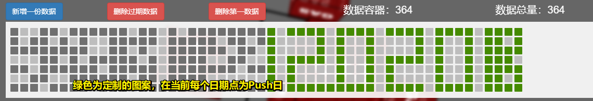
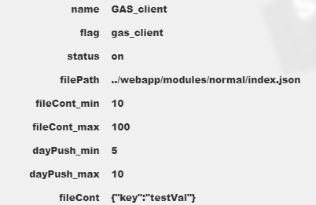
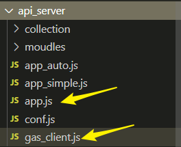
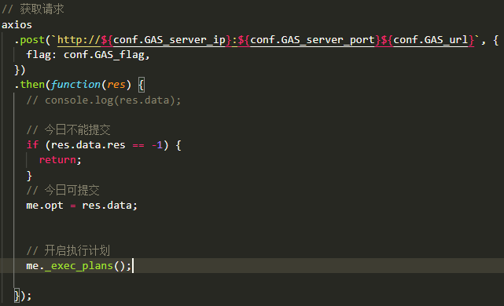
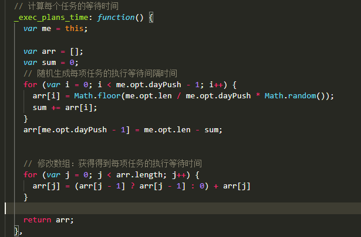
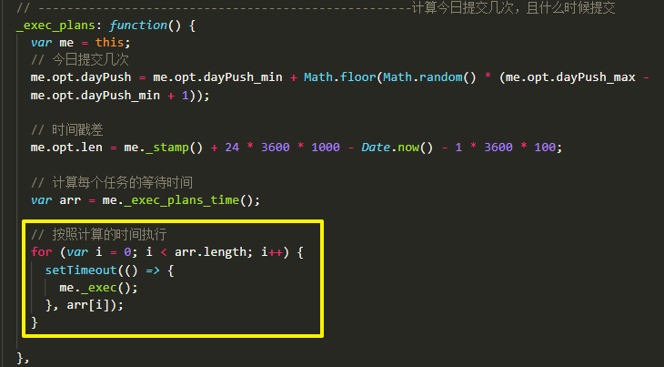
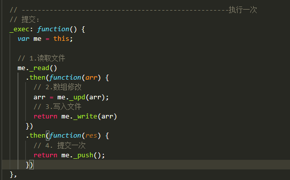

<<<<<<< HEAD
# GAS_client

## 简介

* 基于GAS_server配置的日期为Push日，请求数据，进行相应文件的修改和提交；

## 思路

* 向GAS_server发出请求：用约定的flag进行请求数据，请求配置,返回数据包：

  * 查询当前日期是否为Push日，若为push日，返回client配置的数据包；

  

  * 若不是提交日，或者 总开关关闭，或者没有查询数据，返回-1；不做提交；

* **因为gas_client.js不算具体的业务模块，所以放入和app.js同层的目录：**

## 请求

* 这里使用`axios`进行跨域请求，`GAS_server`需要设置跨域允许；
* 不要使用 `http`模块的`POST`请求，会有问题！

## 提交等待时

* 根据返回的client配置的数据，计算今日该项目需要提交几次；
* 各次提交的等待时间以数组的形式返回；

* 按照计算的间隔时间等待执行计划

## 执行

- 执行：读取文件，修改文件内容，保存文件，提交一次

=======
# GAS_client

## 简介

* 基于GAS_server配置的日期为Push日，请求数据，进行相应文件的修改和提交；

## 思路

* 向GAS_server发出请求：用约定的flag进行请求数据，请求配置,返回数据包：

  * 查询当前日期是否为Push日，若为push日，返回client配置的数据包；

  

  * 若不是提交日，或者 总开关关闭，或者没有查询数据，返回-1；不做提交；

* **因为gas_client.js不算具体的业务模块，所以放入和app.js同层的目录：**

## 请求

* 这里使用`axios`进行跨域请求，`GAS_server`需要设置跨域允许；
* 不要使用 `http`模块的`POST`请求，会有问题！

## 提交等待时

* 根据返回的client配置的数据，计算今日该项目需要提交几次；
* 各次提交的等待时间以数组的形式返回；

* 按照计算的间隔时间等待执行计划

## 执行

- 执行：读取文件，修改文件内容，保存文件，提交一次

>>>>>>> 16c37a159c11c120f4fb416ed60877865842b6d6
